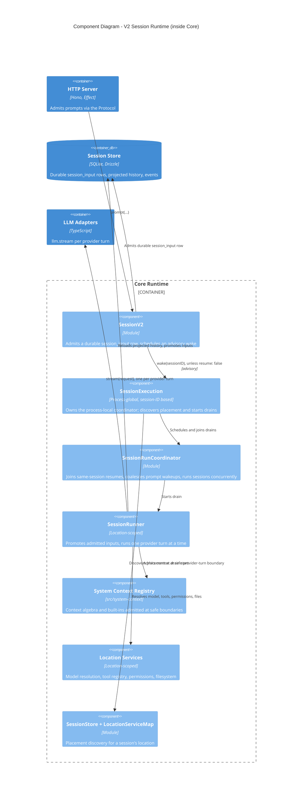

> **Confidentiality:** INTERNAL — Daemon Solutions
> **Document Status:** DRAFT - UNREVIEWED

# OpenCode — V2 Session Runtime (C4 Level 3, inside Core)

The session model is the deepest part of OpenCode. Its defining principle is that **durable prompt admission is kept separate from model execution**: a prompt is first written to the database as a durable input, and only then is execution advised to wake. `CONTEXT.md` defines the precise vocabulary (System Context, Context Source, Context Epoch, Session Drain, Provider Turn, Admitted/Promoted Prompt).

## Key constraints

- **Admission vs execution.** `SessionV2.prompt(...)` admits exactly one durable `session_input` row, then schedules an advisory `SessionExecution.wake(sessionID)` unless `resume: false` requests admit-only behaviour. The serialised runner promotes admitted inputs into visible user messages at safe boundaries.
- **Scope boundaries.** `SessionExecution` is process-global and Session-ID based; `SessionRunner`, model resolution, the tool registry, permissions and the filesystem are **Location-scoped**. Placement is discovered through `SessionStore` plus `LocationServiceMap.get(session.location)` only when a drain starts — no layer takes a Session ID.
- **One stream per provider turn.** The runner makes exactly one `llm.stream(request)` call per provider turn and reloads projected history before durable continuation. It must not bridge through the legacy `SessionPrompt.loop(...)`.
- **Lazy context admission.** The System Context algebra, registry and built-ins live in `src/system-context`; context changes are admitted lazily at a safe provider-turn boundary, never pushed when a source changes.
- **Coalescing & concurrency.** `SessionRunCoordinator` joins explicit same-Session resumes, coalesces prompt wakeups, and lets different Sessions run concurrently. A drain has no durable identity or transcript boundary; post-crash continuation recovery is a separate, explicit design.
