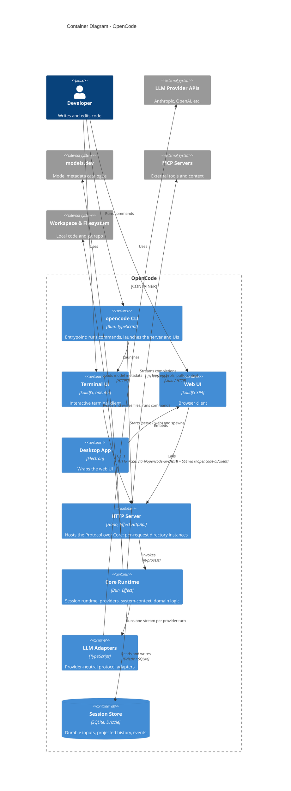

> **Confidentiality:** INTERNAL — Daemon Solutions
> **Document Status:** DRAFT - UNREVIEWED

# OpenCode — Container Diagram (C4 Level 2)

OpenCode ships as a Bun + Turborepo monorepo. At runtime the clients (terminal, web, desktop) talk to an HTTP **Server** that hosts the wire **Protocol** over the **Core** runtime. Core owns the session runtime, providers, the SQLite database and the `system-context` algebra.



## How the clients connect

- The **TUI** spawns a worker that runs the **Server** in-process, then connects to it over HTTP plus a Server-Sent Events stream using the generated `@opencode-ai/client`.
- `opencode serve` runs the **Server** headless (default port 4096), and `opencode web` additionally opens the **Web UI**. The Server loads a per-directory instance from the `x-opencode-directory` request header, so one server can host multiple workspaces.
- The **Desktop App** is an Electron shell around the same Web UI.

## Package dependency direction (the core invariant)

Runtime dependencies point one way; breaking this is the most common way to break the bundle boundaries:

```
schema ─┬─> protocol ─┐
        └─> core ─────┴─> server ──> sdk-next (+ client + core)
client ──> schema, protocol   (NEVER core or server)
```

- **`@opencode-ai/schema` / `@opencode-ai/protocol`** are compile-time shared libraries (Effect `Schema` leaves and the HTTP wire contract), not runtime containers, so they are omitted from the diagram above.
- **`@opencode-ai/client`** is browser-safe and must never transitively load Core, Server, the DB, providers or native modules — it appears here only as the transport label on the UI-to-Server calls.
- **`@opencode-ai/sdk-next`** ("Embedded OpenCode") is an alternative host that runs the Server's router *in memory* with no network I/O, composing Client + Core + Server. It is the embedding path rather than a separately-deployed process.
