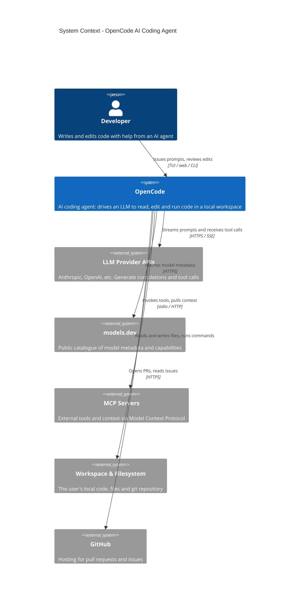

> **Confidentiality:** INTERNAL — Daemon Solutions
> **Document Status:** DRAFT - UNREVIEWED

# OpenCode — System Context (C4 Level 1)

OpenCode is an AI coding agent. A developer issues prompts; OpenCode drives a large language model to read, edit and run code in a local workspace, calling external tools and providers as needed.

## Notes

- **Provider-neutral by design.** Model metadata is sourced from `models.dev`, so adding a provider usually needs no code change here — the catalogue is updated upstream.
- **Local-first.** The primary deployment is a developer's own machine: the workspace, filesystem and git repository are local, and an LLM provider is reached over the network.
- **MCP** lets OpenCode consume external tools and context from separately-run servers over stdio or HTTP.
