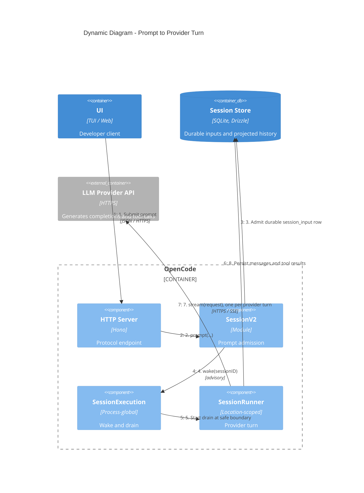

> **Confidentiality:** INTERNAL — Daemon Solutions
> **Document Status:** DRAFT - UNREVIEWED

# OpenCode — Prompt to Provider Turn (C4 Dynamic)

This sequence shows what happens between a developer submitting a prompt and the model producing a turn. It makes the admission-then-wake split concrete: the prompt is durably stored (step 3) before execution is advised (step 4), so a wake is always advisory over already-durable state.

## Flow

1. The client submits a prompt to the Server over HTTP.
2. The Server calls `SessionV2.prompt(...)`.
3. `SessionV2` admits a single durable `session_input` row — the prompt now survives a crash.
4. `SessionV2` schedules an advisory `SessionExecution.wake(sessionID)` (skipped when `resume: false`).
5. `SessionExecution` (via the run coordinator) starts a drain at the next safe provider-turn boundary, coalescing any concurrent wakeups for the same session.
6. The `SessionRunner` reloads projected history and promotes admitted inputs into visible user messages.
7. The runner issues exactly one `llm.stream(request)` for the provider turn; completions and tool calls stream back.
8. Resulting messages and tool results are persisted, after which the runner re-evaluates whether continuation is required before the next turn.
